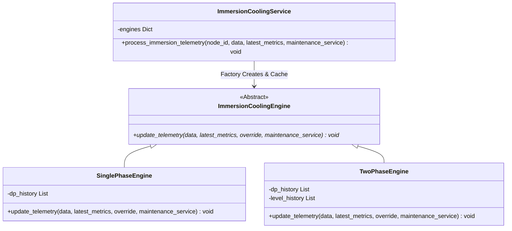

# 單相浸沒式冷卻流體動力中控遙測與閉環自癒系統

本文件詳細闡述單相浸沒式冷卻系統（Single-Phase Immersion Cooling）之核心物理力學引擎、軟體架構解耦設計（物件導向設計模式）、API 遙測結構標準化（Schema Consistency）與前端元件隔離之實作規範。

---

## 一、 物理本質與數學模型

單相冷卻系統與雙相系統不同，液體絕不發生汽化相變，完全依賴**強迫對流（Forced Convection）**傳遞顯熱，其物理行為由以下核心模型控制：

### 1. 核心熱力學傳熱公式

$$\Delta T = \frac{Q}{\dot{m} \cdot c_p}$$

* $Q$：伺服器晶片與輔助配件的總熱負載發熱量（kW）。
* $\dot{m}$：冷卻介質質量流率（kg/s），計算公式為：
  $$\dot{m} = \frac{\text{Flow}_{\text{actual}} \cdot \rho_{\text{oil}}}{60}$$
  其中 $\text{Flow}_{\text{actual}}$ 為實際流量（LPM），$\rho_{\text{oil}}$ 為合成油密度（約 $0.82 \text{ kg/L}$）。
* $c_p$：合成油比熱容（$\approx 2.0 \text{ kJ/(kg} \cdot ^\circ\text{C)}$），約為水的二分之一。
* $\Delta T$：出油口溫度（Outlet Temp）與進油口溫度（Inlet Temp）的溫升梯度。

### 2. Arrhenius 動力黏度修正模型

合成油的動態黏度（Viscosity）對溫度變化極為敏感。本系統採用 Arrhenius 修正方程模擬黏度隨平均油溫的動態改變：

$$\mu(T) = 0.05 \cdot e^{\frac{1600}{T_{\text{avg\_kelvin}}}}$$

* 低溫時（例如進油端低溫運行），油品黏度呈指數上升，流阻增加；高溫時黏度降低，但過高溫度會加速油品氧化。

### 3. Hagen-Poiseuille / Darcy 濾網堵塞與流阻折減模型

過濾器內部的油泥與雜質堆積會使壓差（Pressure Drop, $\Delta P$）顯著攀升，進而限縮泵浦的有效排出量：

1. **基本壓差成長**：隨時間與運轉溫度（高溫加速劣化）緩慢增加，在完全堵塞時達到上限。
2. **阻力折減係數**：
   當濾芯壓差 $\Delta P_{\text{base}} > 3.0 \text{ PSI}$ 時，流阻折減率開始生效：
   $$\text{Factor}_{\text{resistance}} = \max\left(0.15, 1.0 - \frac{\Delta P_{\text{base}} - 3.0}{12.0} \cdot 0.85\right)$$
   當壓差達到 $15.0 \text{ PSI}$ 的極限時，泵浦實際流量（LPM）將會被壓制折減高達 $85\%$。
3. **Darcy 修正壓差**：
   根據流體力學，過濾器兩端最終測得的壓差與實際流速及流體動態黏度成正比：
   $$\Delta P_{\text{final}} = \Delta P_{\text{base}} \cdot \left(\frac{\mu}{10.0}\right) \cdot \left(\frac{\text{Flow}_{\text{actual}}}{15.0}\right)$$

### 4. 閉環自癒調控（Closed-Loop Self-Healing）

1. **泵浦轉速 PID 調節**：系統預設會依據 GPU 即時發熱量自動調節泵浦目標流量，以將晶片溫升控制在安全範圍內（目標 $\Delta T \approx 12.0^\circ\text{C}$）。
2. **流量限制引發的熱失控**：當過濾器嚴重堵塞（$\text{Factor}_{\text{resistance}} \to 0.15$），實際流量嚴重萎縮，導致 $\Delta T$ 超出臨界值，進而觸發功耗壓制保護（Power Throttling）與**自主維護工單派發**。
3. **介電強度與 TAN 自癒再生**：當檢測到冷卻油的總酸值 $\text{TAN} > 0.15 \text{ mg KOH/g}$ 或介電強度 $\text{Dielectric Strength} < 30 \text{ kV}$ 時，自癒中控系統將切換「再生脫水與酸吸附旁路」至全載運轉，直到油品指標恢復安全區間。

---

## 二、 軟體架耦設計 (Design Patterns)

為防範「單/雙相邏輯混雜」造成難以維護的 Spaghetti Code，後端與前端皆採用徹底解耦的設計架構：

### 1. 後端 (FastAPI) - 策略模式與工廠模式

將物理推算引擎抽象為一個策略介面，並衍生出獨立的單相與雙相實作：



* **策略模式（Strategy Pattern）**：`ImmersionCoolingService` 無須知道各個槽體的具體相態細節，僅呼叫共通的 `update_telemetry` 介面，完全抽離 `if-else` 的判斷嵌套。
* **狀態隔離**：所有時序歷史數據（壓差與液位）與老化指標均被內聚在各自的 Engine 實例中，完美避免多槽並發時的數據污染。

### 2. 前端 (React/Next.js) - 2D 元件徹底隔離

前端將原本共用的繪圖面板，明確重構為兩個特徵完全獨立的視覺化渲染組件：
* **`TwoPhaseTankView`**（雙相組件）：繪製飽和液位波形、沸騰相變氣泡上升、以及頂部冷凝盤管雨滴冷凝回流動畫。
* **`SinglePhaseTankView`**（單相組件）：使用 Canvas 2D 渲染動態熱梯度漸層色彩，並配合泵浦流量，繪製向上流動的向量流動小箭頭（Flow Vector Arrows）與進出水泵示意。

---

## 三、 API 遙測結構標準化 (Schema Consistency)

雖然單雙相系統的專屬指標存在物理差異，但為簡化前端解析的負載並保持結構的一致性，後端 HTTP 遙測響應中整合了標準化的嵌套物件 `fluid_health`：

### 1. 單相冷卻油 JSON 響應結構

```json
{
    "tank_id": "IMM-1P-001",
    "type": "immersion_single",
    "filter_dp_psi": 2.2,
    "outlet_temp": 50.0,
    "delta_t": 15.0,
    "should_throttle": false,
    "fluid_health": {
        "type": "SINGLE_PHASE",
        "tan_mg_koh": 0.02,
        "dielectric_kv": 50.0,
        "water_content_ppm": 15.0,
        "viscosity_cst": 10.0
    }
}
```

### 2. 雙相氟化液 JSON 響應結構

```json
{
    "tank_id": "IMM-TP-001",
    "type": "immersion_dual",
    "filter_dp_psi": 2.2,
    "void_fraction": 12.5,
    "should_throttle": false,
    "fluid_health": {
        "type": "TWO_PHASE",
        "ph_value": 7.2,
        "conductivity_us_cm": 0.08,
        "water_content_ppm": 8.0
    }
}
```

這項設計使得前端儀表板的雷達圖或分析指標組件，僅需讀取 `fluid_health.type` 即可完成高效率的動態屬性對照與渲染。

---

## 四、 測試覆蓋率與穩定性

為了維護持續整合（CI/CD）的代碼品質，針對解耦後的 Engine 實施了高精度的單元測試：

1. **`test_immersion.py`**：直接對 `TwoPhaseEngine` 進行實例方法測試（包含核沸騰與臨界膜狀沸騰計算），避免了原先 service 屬性缺失的錯誤。
2. **`test_immersion_single.py`**：增設對 `SinglePhaseEngine` 實作的直接測試案，驗證強制對流與流阻限制公式。
3. **驗證結果**：所有單元測試皆順利在極短時間內運行通過，結果為 `OK`。

---
> [!NOTE]
> 本文件作為單相冷卻遙測模組之架構標準，未來在新增 DLC（直接液冷板）等新模組時，應嚴格遵循此抽象引擎之擴充規範。
