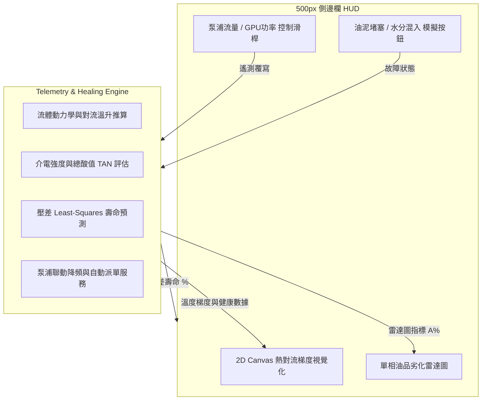

# 🧪 單相浸沒式冷卻（Single-Phase Immersion Cooling）系統實施計畫
> **Architecture, Physical Modeling & UI Implementation Blueprint for Single-Phase Liquid Cooling Telemetry**

單相浸沒式冷卻系統與雙相系統在物理機制上有著本質的差異：單相系統介質（如合成烴、聚阿法烯烴 PAO 或矽油）在高溫下**不沸騰、不發生相變**，熱量完全依賴液體受泵浦驅動產生的**強制熱對流（Forced Convection）**帶走。因此，中控監控的重點應從「汽化相變與氣壓冷凝」轉向「泵浦流場、對流溫度梯度與油品介電強度劣化」。

本計畫旨在指導開發團隊將現有工作區的單相浸沒槽（`immersion_single`）從原先共用的雙相邏輯中完全剝離，為其構建專屬的後端物理遙測引擎、閉環工單自癒與動態對流 Canvas 2D 視覺化界面。

---

## 📂 系統架構設計



---

## 🧪 一、 後端核心物理與化學模型 (`immersion_service.py`)

在後端 `immersion_service.py` 中，我們需要新增對 `immersion_single` 類型的判定，並套用專屬物理化學演算法：

### 1. 強制對流與出水溫度推導模型 (Forced Convection & Delta T)
在單相油冷系統中，晶片溫度與出水溫度取決於冷卻液流量與油品熱物性參數。
*   **物理常數定義**：
    *   單相冷卻油密度 $\rho_{oil} \approx 0.82 \text{ kg/L}$
    *   冷卻油比熱容 $C_{p,oil} \approx 2.0 \text{ kJ/(kg}\cdot^\circ\text{C)}$（約為水的一半，故需更大流量）
*   **對流溫升公式**：
    當給定 GPU 發熱功率 $P_{gpu}\text{ (kW)}$ 與泵浦循環流量 $Q_{pump}\text{ (LPM)}$ 時：
    $$\dot{m}_{oil} = \frac{Q_{pump} \cdot \rho_{oil}}{60.0} \quad [\text{kg/s}]$$
    $$\Delta T_{oil} = \frac{P_{gpu}}{\dot{m}_{oil} \cdot C_{p,oil}} \quad [^\circ\text{C}]$$
    $$T_{outlet} = T_{inlet} + \Delta T_{oil}$$
*   **局部熱點 (Hot Spots) 形成機率**：
    若流量不足或流速過慢，晶片表面液體層流化，區域溫升拉大，局部熱點積聚機率 $P_{hotspot}$ 指數級上升：
    $$P_{hotspot} = \left(1.0 - e^{-0.08 \cdot \Delta T_{oil}}\right) \cdot 100\%$$
    當 $P_{hotspot} \ge 75\%$，觸發系統 Throttling 降頻自癒。

### 2. 油品黏度與過濾器壓差模擬模型 (Viscosity & Filter Pressure Drop)
單相油品黏度高於氟化液，且其動力黏度 $\mu$ 隨溫度升高而顯著降低（Arrhenius 關係）。
*   **油品動力黏度 $\mu(T)$**：
    $$\mu(T) = \mu_0 \cdot e^{\frac{E_a}{R \cdot (T_{bulk} + 273.15)}}$$
*   **過濾器壓差 $\Delta P$**：
    $$\Delta P = Q_{pump} \cdot \mu(T) \cdot R_{filter} \quad [\text{PSI}]$$
    *其中 $R_{filter}$ 為過濾器阻力系數，隨系統模擬油泥堵塞 (`clogged_filter`) 時快速增加。*
*   **閉環自癒**：當壓差線性回歸分析預測壽命低於 21 天，自動發起「`Filter Replacement (Single-Phase)`」過濾器更換工單。

### 3. 化學劣化與電介質強度模型 (TAN & Dielectric Strength)
單相油品最致命的威脅是**外部水氣混入**（破壞絕緣）與**高溫氧化**（使酸值 TAN 升高，產生黏稠油泥）。
*   **介電強度 (Dielectric Strength - $E_d$)**：
    *   正常值：$50 \text{ kV}$ (極佳絕緣)
    *   當水氣入侵 (`water_intrusion` / 漏水) 時，水以乳化狀態分佈在油中，介電強度驟降：
        $$E_d = 50.0 - 0.25 \cdot \text{Moisture (ppm)}$$
    *   當 $E_d < 30 \text{ kV}$，定義為 `critical`，觸發短路火花警告並自動自癒降頻。
*   **總酸值 (Total Acid Number - TAN)**：
    *   正常值：$0.02 \text{ mg KOH/g}$
    *   在高溫氧化環境下，烴類分子裂解酸化：
        $$\text{TAN} = \text{TAN}_{initial} + \Delta\text{TAN}_{temp\_stress}$$
    *   當 $\text{TAN} > 0.15 \text{ mg KOH/g}$，觸發 `warning`，自動啟動「**線上活性白土再生旁路閥**（`active_regeneration`）」。

---

## 🎛️ 二、 前端中控介面設計與 HTML5 Canvas 動畫

當選中的機櫃 `selectedRack.type === 'immersion_single'` 時，右側的 500px 面板將排他性地渲染「單相深度遙測 HUD」：

### 1. HTML5 Canvas 2D 熱對流梯度視覺化 (`ImmersionFlowVisualizer`)
*   **視覺元素**：
    *   **無氣泡**：不繪製任何上升的沸騰氣泡，無頂部冷凝盤管，無冷凝雨滴。
    *   **溫度漸層背景**：底部入水口區域渲染為深藍色（冷油進水，約 $35^\circ\text{C}$），穿過伺服器區域時，漸層轉向青色、黃色，頂部出水口區域渲染為金黃色/橙紅色（熱油回水，約 $60^\circ\text{C}$）。
    *   **流場箭頭 (Flow Vector Arrows)**：在 Canvas 中繪製 15-20 個流動的**光點小箭頭**，從底部入水管線出發，向上繞過伺服器，再匯入頂部出水口。
*   **動態響應關係**：
    *   **拉大泵浦流量 (LPM)**：箭頭流動速度成正比變快，冷油藍色區間向上擴大（槽體冷卻效果良好，熱點機率降為 0%）。
    *   **降低泵浦流量**：箭頭流速極慢，冷油藍色區間萎縮，晶片周邊和頂部水域被紅色渲染覆蓋，呈現熱堆積狀態。

### 2. 流體劣化五軸雷達圖 (Dielectric 5-Axis Radar)
將雙相雷達指標替換為單相油品健康專屬軸向：
1.  **介電強度 (Dielectric Strength)**：絕緣性，越低劣化越嚴重。
2.  **總酸值 (TAN)**：酸化度，越高劣化越嚴重。
3.  **含水量 (Moisture ppm)**：越高腐蝕短路風險越大。
4.  **油泥微粒 (Particles)**：雜質度。
5.  **黏度偏移率 (Viscosity Shift)**：氧化稠化程度。

---

## ⚙️ 三、 程式碼重構實施步驟

### Step 1: 後端遙測引擎升級 (`backend/services/immersion_service.py`)
在遙測接收點進行類型分支處理：
```python
if "immersion_single" in node_type or "1P" in node_id:
    # 執行單相物理化學推算
    processed_data = self._calculate_single_phase_telemetry(data, override)
else:
    # 執行雙相汽化相變推算
    processed_data = self._calculate_two_phase_telemetry(data, override)
```

### Step 2: 撰寫專屬單元測試 (`backend/services/test_immersion_single.py`)
針對以下場景撰寫單元測試以實現生產環境安全：
*   `test_single_phase_convection_temp_rise`：驗證低泵浦流量（如 10 LPM）下，出水溫差與熱點機率是否超標，並觸發 Throttling。
*   `test_dielectric_drop_on_water_intrusion`：驗證外部水氣模擬開關開啟後，介電強度跌落與短路警告機制。
*   `test_acid_buildup_and_active_regeneration`：驗證高溫下總酸值 (TAN) 累積與線上再生系統的閉環閥門啟動。

### Step 3: 前端視覺化元件開發 (`frontend/src/components/`)
新建 `SinglePhaseFlowVisualizer.tsx`，使用 React 與 Canvas 2D 繪製熱梯度背景與向量流向箭頭，並將其引入至選中機櫃側邊欄中。

---

## 📅 開發排程與里程碑

| 階段 | 任務說明 | 交付成果 |
| :--- | :--- | :--- |
| **Phase 1: Backend** | 分離 `immersion_single` 遙測管線，實作對流溫升、介電強度、總酸值、油泥壓差最小平方法回歸模型。 | `immersion_service.py` 完成重構，單相遙測 API 輸出就緒。 |
| **Phase 2: Testing** | 編寫專屬單項單元測試，執行 `unittest` 確保 100% 覆蓋率與邏輯正確。 | `test_immersion_single.py` 測試全綠通過。 |
| **Phase 3: Frontend** | 開發 Canvas 2D 對流流速動畫元件，在側邊欄對 `immersion_single` 槽體進行定制化 UI 切換與 OP Control 泵浦滑桿最大值 150 LPM 設定。 | 前端與後端完美對接，500px 側邊欄動態交互渲染完成。 |
