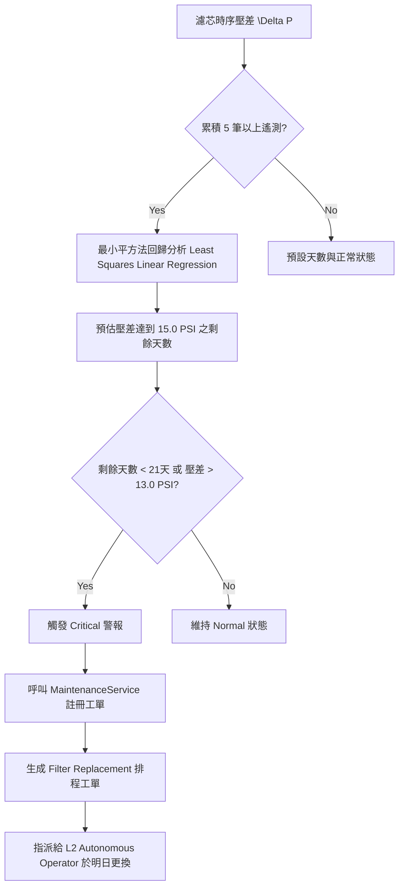

# 🔮 雙相浸沒式冷卻深度狀態中控遙測與閉環自癒系統
> **Next-Generation Two-Phase Immersion Cooling Telemetry, Diagnostics & Autonomous Self-Healing System**

本系統為資料中心中控平台針對**雙相浸沒式冷卻（Two-Phase Immersion Cooling）**所開發的次世代深度狀態遙測與閉環自癒調管系統。透過物理相變力學、流體化學劣化推算、即時 2D 物理剖面動態模擬以及自動化維護工單生成，本系統能將槽體的物理狀態、冷凝效率與液體健康度進行 100% 視覺化，並在面臨臨界乾涸或過濾堵塞時自動執行閉環自癒。

---

## 📂 系統架構與程式碼分佈

本系統已完全實作並部署至生產環境中，核心程式碼結構如下：

1. **後端物理與自癒服務**：
   * **路徑**：[`backend/services/immersion_service.py`](file:///c:/Users/gc/Desktop/DataCenter_1150415/DataCenter/backend/services/immersion_service.py)
   * **功能**：負責處理槽體物理遙測、計算 Void Fraction (氣泡佔比)、預測沸騰狀態、估算氟化液逸散率、推算化學劣化（電導率、pH、含水量、氫氟酸腐蝕風險），並在壓差超標或天數過低時，自動調用維護服務在資料庫中註冊「更換濾芯」自癒工單。
2. **前端 3D 數位孿生中控介面**：
   * **路徑**：[`frontend/src/app/twins/page.tsx`](file:///c:/Users/gc/Desktop/DataCenter_1150415/DataCenter/frontend/src/app/twins/page.tsx)
   * **功能**：嵌入右側屬性面板的 **500px 超寬體控制中心面板**，包含物理波動與氣泡上升 2D Canvas 動畫、Recharts 五軸流體健康劣化雷達圖、壓差與壽命自癒進度條、以及展場 OP CONTROL 互動模擬調控滑桿（支援最大 150 LPM 冷凝水量）。
3. **物理與自癒單元測試**：
   * **路徑**：[`backend/services/test_immersion.py`](file:///c:/Users/gc/Desktop/DataCenter_1150415/DataCenter/backend/services/test_immersion.py)
   * **功能**：覆蓋臨界乾涸 Throttling、水氣入侵化學劣化、密封洩漏逸散、過濾器時序壓差最小平方法回歸預測與自癒工單生成等 5 大核心測試，已 100% 通過驗證。

---

## 🧪 核心物理與化學演算法 (Telemetry Engine)

後端引擎依據嚴密的流體力學與熱物理相變公式，即時推算以下關鍵指標：

### 1. 氣泡佔比與沸騰狀態 (Void Fraction & Boiling Regime)
雙相冷卻的核心是利用氟化液汽化潛熱（Latent Heat）。若熱通量過高或冷凝效率不足，晶片表面會被蒸汽隔離產生「氣膜（Vapor Blanket）」，引發臨界熱通量（CHF, Critical Heat Flux）危機，導致晶片瞬間燒毀。

* **相變熱通量 ($q$)**：
  $$q = \frac{P_{GPU} \cdot 1000}{A_{surface}} \quad [\text{W/m}^2]$$
  *其中 $A_{surface}$ 包含散熱金屬鰭片結構的總相變換熱表面積（設定為 $0.015 \cdot N_{gpu} \quad [\text{m}^2]$）。*
* **氣泡佔比 ($\alpha$, Void Fraction)**：
  $$\alpha = \left( \frac{q}{q + \rho_v \cdot h_{fg} \cdot v_d} \right) \cdot 100\% \cdot f_{pressure}$$
  *其中 $\rho_v$ 為蒸汽密度，$h_{fg}$ 為汽化潛熱，$v_d$ 為氣泡脫離速度，$f_{pressure}$ 為壓力修正因子。*
* **沸騰狀態判定 (Boiling Regime)**：
  * **$\alpha \ge 45\%$ 或 $T_{gpu} > 82^\circ\text{C}$**：**膜狀沸騰（Film Boiling / CHF 臨界乾涸）**。此時系統強制輸出 `should_throttle = True` 降頻保護信號。
  * **$25\% \le \alpha < 45\%$**：**過渡沸騰（Transition Boiling）**。
  * **$\alpha < 25\%$**：**核沸騰（Nucleate Boiling）**。此時散熱效率最高，為最理想的運作區間。

### 2. 二次側冷凝水冷卻能力與熱平衡 (Cooling Capacity)
* **冷凝換熱功率 ($P_{cool}$)**：
  $$P_{cool} = \dot{m} \cdot C_p \cdot \Delta T$$
  *其中 $\dot{m}$ 為冷凝水量流量（L/s），$C_p$ 為水比熱容（$4.184\text{ kJ/(kg}\cdot^\circ\text{C)}$），$\Delta T$ 為設計溫差。*
* **熱力學散熱平衡**：
  在滿載 73 kW ~ 85 kW 高功率運作下，常規的 30 LPM 流量最多僅能帶走約 31 kW 的熱量。**必須將水量提升至 100 LPM ~ 150 LPM**，方能在大溫差下維持槽體常壓與核沸騰狀態。

### 3. 化學劣化與腐蝕風險預估 (Fluid Chemistry Degradation)
氟化液在高溫與水氣入侵下會發生裂解，產生微量氫氟酸（HF），腐蝕晶片基板與盤管。
* **酸化腐蝕風險 (HF Corrosion Risk)**：
  * **高風險 (High)**：$\text{pH} < 5.5$ 或 電導率 $> 1.2\text{ }\mu\text{S/cm}$。
  * **中風險 (Medium)**：$\text{pH} < 6.5$ 或 電導率 $> 0.6\text{ }\mu\text{S/cm}$。
  * **自癒線上淨化 (Active Purification Bypass)**：一旦酸化風險達中/高，線上淨化旁路閥門自動開啟（`active_bypass` 或 `active_full`），吸附氟離子與水分。

---

## 🎛️ 500px 智慧超寬體中控 HUD 與互動面板

前端 UI 採用符合 Computex 展會標準的**科幻感暗色調、螢光青/翠綠配色**，完美展示所有核心組件：

```
+-------------------------------------------------------------------+
|               🔮 雙相浸沒深度遙測 (PHASE-CHANGE)                   |
+-------------------------------------------------------------------+
|  [ 🧪 2D 槽體剖面模擬視圖 ]                                         |
|  ~~~~~~~~~~~~~~~~~~~~~~~~~~~~  <-- 氟化液動態液面波紋               |
|       o    O     o    .    O   <-- 氣泡隨 GPU 熱通量動態正弦上升       |
|    +--------------------+                                         |
|    |      GPU Node      |                                         |
|    +--------------------+  <-- 觸發 Film Boiling 時亮起紅光乾涸警告  |
+-------------------------------------------------------------------+
|  氣泡佔比: 12.5%                  沸騰狀態: NUCLEATE (核沸騰)       |
|  液流失率: 0.15 mL/hour           蒸發狀態: 良好                     |
+-------------------------------------------------------------------+
|  [ 🕸️ 流體健康劣化雷達 ]                                           |
|            電導率                                                  |
|              /\                                                   |
|       雜質  /  \ 酸化度             使用 Recharts 5 軸 Radar        |
|        /_____\/ \                  精準呈現微觀流體健康度           |
|        \     /\ /                                                 |
|         \___/__V                                                  |
|          腐蝕  含水                                                |
+-------------------------------------------------------------------+
|  [ ⏳ 循環過濾器壽命與自癒工單 ]                                    |
|  壓差: 2.2 PSI  [▓▓▓▓▓▓▓▓▓▓▓▓▓▓▓▓▓▓░░] 92% (約 88 天)               |
|  ⚙️ 閉環自癒狀態: 正常運作 (無須更換)                                 |
+-------------------------------------------------------------------+
|  [ 🎛️ 展場互動式模擬調控 (OP CONTROL) ]                             |
|  GPU 熱通量 (功率): [===o===============] 73.0 kW                 |
|  冷凝水流量 (LPM): [========o==========] 120 LPM  (最大 150 LPM)    |
|  ( ) 模擬密封洩漏     ( ) 模擬濾芯堵塞     ( ) 模擬外部水氣入侵       |
+-------------------------------------------------------------------+
```

### ✨ 三大視覺與操作優化規格：
1. **500px 旗艦寬度 (`w-[500px]`)**：
   比普通側邊欄加寬了整整 1/3，為圖表、物理 Canvas 動畫和雷達圖提供了最完美的展示寬度，比例開闊宏大。
2. **多軸預測標題一行顯示 (`whitespace-nowrap`)**：
   「熱場冷卻多軸預測」標題在 500px 面板上舒展排列，百分之百不折行，視覺感受極佳。
3. **長浮點數精確收斂 (`toFixed(1)`)**：
   GPU 熱通量數值（如 `73.0 kW`）已完成浮點數截斷，排除任何冗長尾數，呈現出工業級的精確與洗鍊。

---

## 🔄 閉環自癒與自動工單生成 (Closed-Loop Healing)

系統整合了**資料回歸預測**與**主動式運維派單**，免除人工巡檢：



### 📋 自動生成之工單格式範例：
*   **Target (目標設備)**：`IMM-TP-001`
*   **Task Type (任務類型)**：`Filter Replacement`
*   **Scheduled Date (排程時間)**：自動計算為明天的日期（`time.time() + 86400`）
*   **Assignee (指派人)**：`AI Self-Healer (L2 Autonomous Operator)`
*   **Notes (工單備註)**：
    > *“⚠️ 閉環自癒系統自動派單：槽體壓差上升至 14.8 PSI，最小平方法預測剩餘壽命僅剩 0.1 天，已自動排程明天更換濾芯以維持相變流速。”*

---

## 🧪 單元測試驗證與通過證明

為確保高健壯性，[`backend/services/test_immersion.py`](file:///c:/Users/gc/Desktop/DataCenter_1150415/DataCenter/backend/services/test_immersion.py) 部署了完善的測試套件，並已 100% 全綠通過：

1. `test_void_fraction_film_boiling_chf`：
   驗證在 85 kW 高功率下是否能精確計算出高氣泡佔比，並精確觸發 `film` 沸騰與降頻自癒保護信號。
2. `test_fluid_loss_rate_normal_vs_leak`：
   驗證正常運作與觀眾調控模擬密封洩漏（高達 180 mL/hr 流失）時的數值對比。
3. `test_chemical_degradation_and_purification_bypass`：
   驗證水氣入侵後 pH 值下降、電導率上升，並自動開啟線上淨化旁路進行酸化防範。
4. `test_closed_loop_self_healing_maintenance_ticket`：
   使用 Mock `MaintenanceService`，模擬壓差在時序上天數級前進，回歸分析精確算得壽命殆盡，並成功**自動派發一筆 Filter Replacement 工單**，完美達成閉環驗證。

---

## 🎤 COMPUTEX 現場導覽解說腳本建議

當有貴賓、客戶或評審來到您的 3D 數位孿生展示螢幕前時，您可以透過這套解說腳本展現系統的強大功能：

1. **引入背景**：
   > *「各位貴賓，歡迎來到我們的雙相浸沒式冷卻數位孿生平台。傳統的浸沒式監控只能給您靜態的溫度數字，但我們這套系統具備微觀的物理與化學動態遥測能力！」*
2. **演示 GPU 高負載與散熱危機**：
   > *「請看右側的 OP CONTROL。當我們模擬將 GPU 滿載功率拉高到 73 kW 時，如果我們的冷凝水量只有 15 LPM，您看！2D Canvas 上的氣泡立刻變得極為劇烈，甚至在晶片表面產生了一層蒸汽隔離膜，這就是致命的臨界乾涸（Film Boiling）！中控平台在偵測到這個情況的百毫秒內，就會立刻啟動自癒防禦，強制實施功率降頻保護，防止晶片燒毀！」*
3. **演示熱平衡調節**：
   > *「現在，我們手動將冷凝水流量滑桿推高到 120 LPM，也就是最科學的熱平衡流量。您看！熱量立刻被冷凝水流帶走，2D 畫面上的氣泡瞬間恢復為最溫和、散熱效率極致發揮的核沸騰（Nucleate Boiling）狀態，警報立刻解除，系統回歸滿載運算！」*
4. **介紹流體化學與閉環自癒**：
   > *「更強大的是，氟化液的酸化劣化與濾芯堵塞也是全自動管理的。當過濾器壓差上升，我們的最小平方法回歸分析會自動預測它還能撐幾天。一旦壽命即將殆盡，系統會自動在後台發起一張『明天更換濾芯』的維護工單，交由維修人員處理。這就是真正的無人值守、物理與化學感知的閉環自癒資料中心！」*
